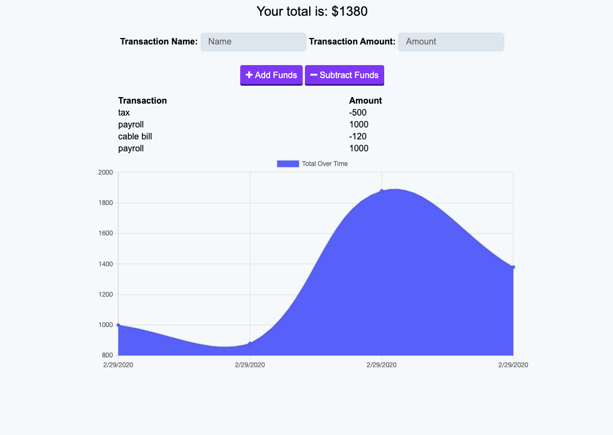

# budget-app
This app allows users to keep track of items in a budget. Users can input transactions by name and amount and add or subtract them from the budget total. The app includes online and offline functionality. The transaction details appear in  easy to read columns. The app also automatically outputs transaction information into a line graph, to allow users to quickly assess the significance of each transaction in the overall budget. The was build for chapter 18 in the JHU Full Stack Web Development BootCamp. 

##  New Technologies Used 

* IndexedDB
* cache API
* Service Worker

## Link to deployed page 
 <a href ="https://secure-escarpment-03742.herokuapp.com/" target="_blank">Click Here to View</a>

 ## ScreenShot 

 
 

